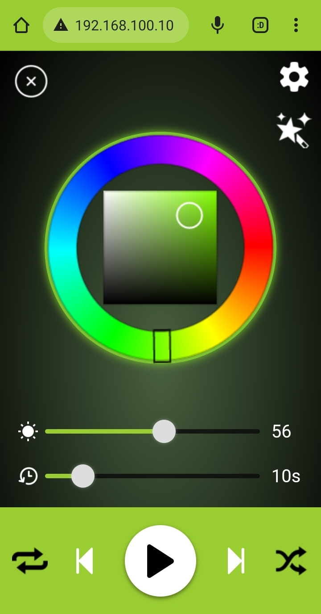
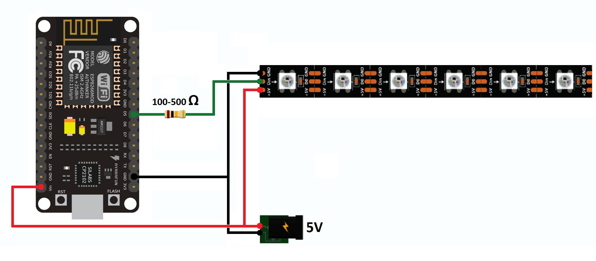

# ESP8266 - Websockets - LED strip

Control an addressable LED strip with an ESP8266 via a Web browser.



## Features
* Synchronization between all connected devices
* Desktop and mobile Web interface
* Сhoosing themes
* Brightness adjustment
* Loop duration adjustment
* Color change (thanks to [NC22](https://github.com/NC22/HTML5-Color-Picker) for the colorpicker)
* Selection of different effects (more will be added)

## Hardware
* ESP8266-based board
* Addressable LED strip (WS2811, WS2812, WS2812B)
* 100 to 500 Ohm resistor (preferably)
* 3.3V to 5V power supply (if you have a strip <60 leds, you can be powered directly from ESP, but the diodes can "flicker")

#### Wiring diagram


## Software
The Web application is a single page application that is written in native JS and CSS, so it is quite lightweight.

ESP8266 is a Web server. After your browser downloads the web files, the connection immediately switches to the websockets protocol. Over this, synchronization between clients was implemented. This means that by changing the status of the strip, the changes will be visible to all connected devices. The addressable strip is managed only through the websockets, so the status changes "instantly".

*Note, although the brightness slider use a delayed event handler (to prevent from flooding the ESP with too many requests too quickly), during execution "heavy" effects (they are marked in the code) with a quick change of brightness, ESP may be unavailable (until effect loop is completed) and messages will go to the senting queue.*
## Installing
The first thing you need to do is install the [Arduino IDE](https://www.arduino.cc/en/software) , **BUT**:

At the moment, latest Arduino IDE (**2.0**) does not support the file system plugin (required to upload web files to ESP flash memory). See [relevance](https://github.com/arduino/arduino-ide/issues/58).\
Therefore, you need to install version (**1.8.x**), **however**:

You can try the `simplified version` which does not depend on the file system plugin but with a minimalistic interface. When you are sure everything is working, I strongly recommend installing the main version!

The ESP8266 boards will need to be added to the Arduino IDE which is achieved as [follows](https://github.com/esp8266/Arduino).\
[The ESP8266 filesystem plugin](https://github.com/esp8266/arduino-esp8266fs-plugin) (you will find the installation instructions in the same place).

Dependency only on the following libraries:
* [Websocket library](https://github.com/Links2004/arduinoWebSockets) (available from the library manager)
* [FastLED library](https://github.com/FastLED/FastLED) (available from the library manager)
#### In the end
* Connect your ESP8266 to your computer
* Open `ESP8266-LED.ino` and update the following lines:
```c++
#define LED_COUNT 60 // the number of pixels on the strip
#define DATA_PIN 14 // (D5 nodemcu) pin where is connected the data pin

const char* ssid = ""; // SSID of the access point
const char* password = ""; // password (if the access point is open, leave it empty)

IPAddress Ip(192,168,100,10); // IP address for your ESP
IPAddress Gateway(192,168,100,1); // IP address of the access point
```
* Upload the sketch
* In the IDE's top menu, select `tools` -> `ESP8266 Sketch Data Upload` to upload files from the `data` directory to ESP flash memory
* Open the serial port monitor (if the connection is successful, IP your ESP will be displayed)
* Open the browser and enter the IP address.
#### Happy use ッ